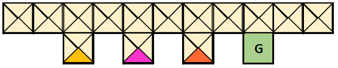
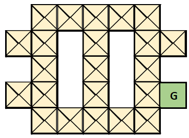

# pomdp_domains
Implementation of the [Hallway and Hallway2](https://www.sciencedirect.com/science/article/pii/B9781558603776500529) domains as extension to OpenAI Gym 0.15.4. In each grid position but the goal state, 4 orientations are possible, which leads to a total of 57 states for the Hallway domain and of 89 states for the Hallway2 domain. The start state is chosen uniformly at random from the non-terminal states and an episode ends when the goal state has been reached or when 100 steps have been executed. At each time step, the agent can choose from the actions "stay," "forward," "turn right," "turn left" and "turn around." A reward of 1 is obtained for arriving in the goal state and a reward of 0 for arriving in any other state. In each state, the agent generally observes the presence of a wall in each of the 4 possible locations. However, when the agent arrives in the goal state, it receives a distinct observation. In addition, when the agent faces south in one of the non-terminal states in the second row of the Hallway domain, a distinct observation is obtained. The default transition and observation probabilities are based on the ones described [here](https://www.springer.com/gp/book/9783642136382). 

In addition, there are simplified versions of the Hallway domain (Hallway_Simple) and the Hallway2 domain (Hallway2_Simple), in which the agent can solely choose from the actions "forward," "turn right," and "turn left."

**Hallway**

**Hallway2**

